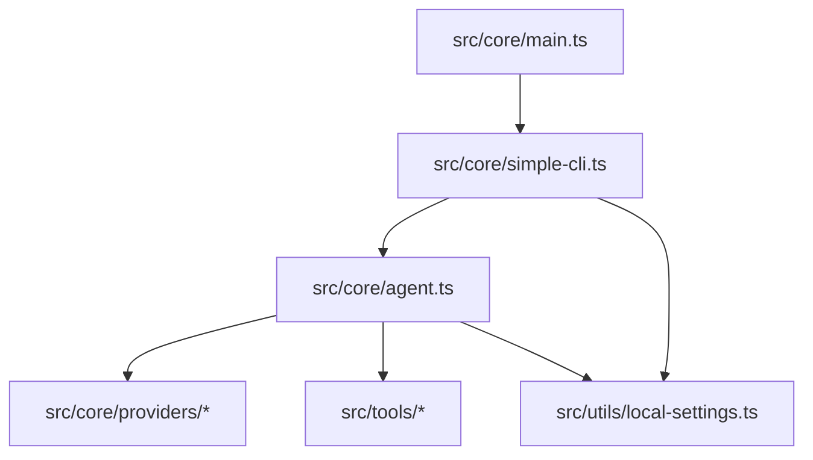
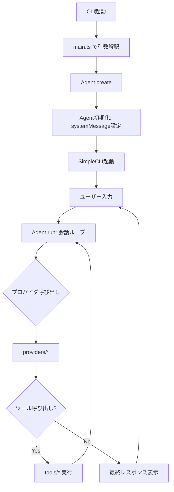

# アーキテクチャ理解メモ

このドキュメントは、CLIの実行フローと主要モジュールを理解するための学習メモ。
最初は粗く書き、コードを読みながら追記していく。

## 実行フロー（ざっくり）

## モジュールの役割（1行）

- src/core/main.ts: エントリーポイント。設定を読み、CLIを起動。
- src/core/simple-cli.ts: 端末I/O、コマンド処理、コールバック、セッション統計。
- src/core/agent.ts: 会話ループ、ツール実行、プロバイダ制御。
- src/core/providers/*: プロバイダごとのAPI呼び出しとusage取得。
- src/tools/*: ツール定義、実装、安全フィルタ。
- src/utils/local-settings.ts: 設定ファイルの読み書き。

## 全体像（要点だけ）

- 入力: CLI引数と対話入力（main.ts → SimpleCLI）。
- 中心: Agentが会話状態とツール実行を管理。
- 外部境界: providersがAPI呼び出し、toolsがローカル副作用。
- 設定: ConfigManagerで永続設定を読み書き。

## 実行フロー（詳細版）

## 設定対応表（local-settings.json -> 使いどころ）

- groqApiKey: ConfigManager.getApiKey() でGroq認証に使用。
- anthropicApiKey: ConfigManager.getAnthropicApiKey() でAnthropic認証に使用。
- geminiApiKey: ConfigManager.getGeminiApiKey() でGemini認証に使用。
- provider: ConfigManager.getProvider() でデフォルトプロバイダ選択。
- defaultModel: ConfigManager.getDefaultModel() でモデル選択。
- groqProxy: ConfigManager.getProxy() でGroqのプロキシ設定。
- dangerousDirectories: ConfigManager.getDangerousDirectories() で危険ディレクトリ判定。
- dangerousFiles: ConfigManager.getDangerousFiles() で危険ファイル判定。

## コールバック（SimpleCLI -> Agent）

- onThinkingText: 思考/途中出力の表示。
- onFinalMessage: 最終メッセージの表示。
- onToolStart/onToolEnd: ツール実行の開始/終了表示。
- onToolApproval: 危険操作の確認。
- onApiUsage: トークン使用量の集計。
- onMaxIterations/onError: 上限/エラー時の制御。

## TODO / 未確認

- src/core/main.ts の正確な初期化順序を確認。
- プロバイダごとのusage項目の差を整理。
- ツールスキーマと実装、承認ルールの対応関係を整理。

## 追加メモの雛形

以下を各ファイルごとに追記していく想定。

### [file] src/core/main.ts

- 役割:
- 呼ばれる順序:
- 主要な依存:
- 気づき:
- 疑問/ TODO:
